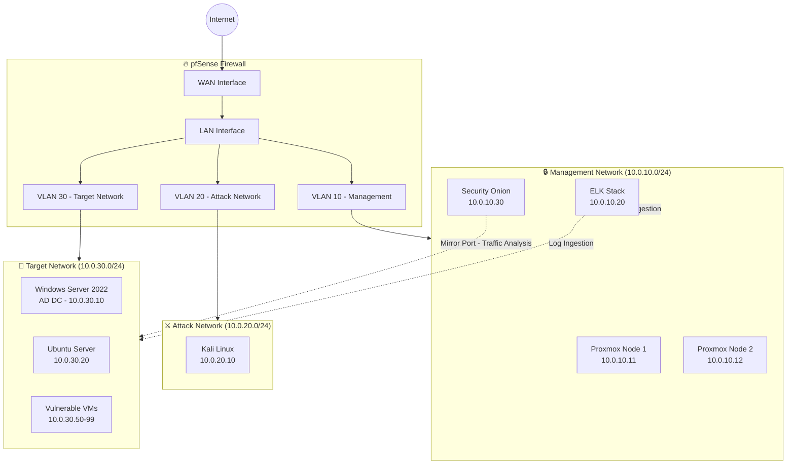

# 🏠 Cybersecurity Homelab

    

Complete security testing environment for hands-on practice with enterprise security tools and attack simulation.

---

## 📋 Overview

**Purpose:** An isolated, enterprise-grade security lab for:
- Penetration testing practice
- Security tool evaluation
- Attack simulation and defense
- Certification exam preparation (OSCP, CEH, Security+)

---

## 🖥️ Hardware

| Component | Spec |
|-----------|------|
| Servers | 2x Dell PowerEdge R720 (Proxmox cluster) |
| RAM | 128GB total (64GB per node) |
| Storage | 4TB RAID 10 |
| Networking | Dedicated gigabit switch |

---

## 🌐 Network Architecture



---

## 🔒 Security Zones

| Zone | Subnet | Purpose | Access |
|------|--------|---------|--------|
| Management | 10.0.10.0/24 | Admin, monitoring, SIEM | Restricted |
| Attack | 10.0.20.0/24 | Kali Linux, offensive tools | Isolated |
| Target | 10.0.30.0/24 | Vulnerable systems, AD lab | Attack network only |

---

## 🖥️ Virtual Machines

| VM | OS | IP | Role |
|----|----|----|------|
| pfSense | FreeBSD | 10.0.10.1 | Firewall / router |
| Security Onion | Ubuntu | 10.0.10.30 | NSM / IDS |
| ELK Stack | Ubuntu | 10.0.10.20 | SIEM / log analysis |
| Kali Linux | Debian | 10.0.20.10 | Penetration testing |
| Windows Server 2022 | Windows | 10.0.30.10 | Active Directory DC |
| Ubuntu Server | Ubuntu | 10.0.30.20 | Web services |

---

## 📁 Repository Structure

```
homelab/
├── README.md
├── docs/
│   ├── setup-guide.md          # Full lab setup walkthrough
│   ├── network-design.md       # Network design decisions
│   ├── vm-provisioning.md      # VM creation and configuration
│   └── learning-outcomes.md    # Skills and certifications
├── configs/
│   ├── pfsense/                # Firewall rules and VLAN config
│   ├── elk/                    # Logstash pipelines, index templates
│   ├── security-onion/         # SO sensor and alert tuning
│   └── active-directory/       # AD hardening and GPO configs
└── diagrams/
    └── network-topology.md     # Mermaid network diagrams
```

---

## 📚 Documentation

- [Full Setup Guide](./docs/setup-guide.md)
- [Network Design](./docs/network-design.md)
- [VM Provisioning](./docs/vm-provisioning.md)
- [Learning Outcomes](./docs/learning-outcomes.md)

---

## ⚙️ Configs

- [pfSense Firewall Rules](./configs/pfsense/firewall-rules.md)
- [ELK Stack Pipeline](./configs/elk/logstash-pipeline.conf)
- [Security Onion Tuning](./configs/security-onion/sensor-config.md)
- [Active Directory Hardening](./configs/active-directory/hardening.md)

---

## 🎓 Learning Outcomes

- Enterprise firewall configuration and rules
- SIEM deployment and log analysis
- Network segmentation and VLANs
- IDS/IPS configuration and tuning
- Active Directory security hardening

---

*Part of [Chad Hackerman's Portfolio](https://github.com/chad-hackerman/chad-hackerman-portfolio)*
