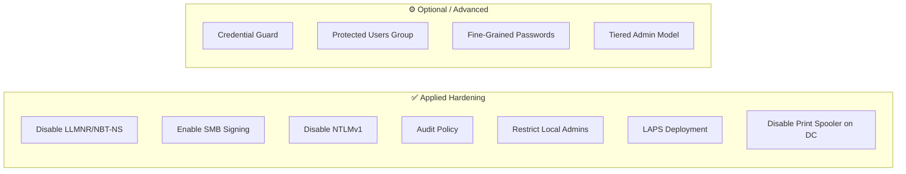

# Active Directory Hardening

Group Policy and configuration hardening applied to the homelab Active Directory environment.

---

## Overview

The AD lab is intentionally configured in two states:
1. **Vulnerable state** — default/weak settings for attack practice
2. **Hardened state** — security controls applied for defense practice

Proxmox snapshots make it easy to switch between states.

---

## Hardening Checklist



---

## Group Policy Objects

### GPO 1 — Disable LLMNR and NBT-NS

Prevents Responder/LLMNR poisoning attacks.

```
GPO Name: Security - Disable LLMNR NBT-NS
Linked to: homelab.local (domain root)

Computer Configuration → Administrative Templates →
  Network → DNS Client →
    Turn off multicast name resolution: ENABLED

Computer Configuration → Administrative Templates →
  Network → Network Connections → Windows Defender Firewall →
    (NetBIOS over TCP/IP disabled via registry)
```

**Registry equivalent:**
```powershell
# Disable LLMNR
Set-ItemProperty -Path "HKLM:\SOFTWARE\Policies\Microsoft\Windows NT\DNSClient" `
    -Name "EnableMulticast" -Value 0 -Type DWord

# Disable NBT-NS on all adapters
$adapters = Get-WmiObject Win32_NetworkAdapterConfiguration
foreach ($adapter in $adapters) {
    $adapter.SetTcpipNetbios(2)  # 2 = Disable NetBIOS over TCP/IP
}
```

---

### GPO 2 — Enable SMB Signing

Prevents NTLM relay attacks.

```
GPO Name: Security - Enable SMB Signing
Linked to: homelab.local

Computer Configuration → Windows Settings → Security Settings →
  Local Policies → Security Options →
    Microsoft network server: Digitally sign communications (always): ENABLED
    Microsoft network client: Digitally sign communications (always): ENABLED
```

---

### GPO 3 — Audit Policy

Enables verbose security logging for SIEM ingestion.

```powershell
# Apply via auditpol
auditpol /set /subcategory:"Logon" /success:enable /failure:enable
auditpol /set /subcategory:"Account Logon" /success:enable /failure:enable
auditpol /set /subcategory:"Kerberos Authentication Service" /success:enable /failure:enable
auditpol /set /subcategory:"Kerberos Service Ticket Operations" /success:enable /failure:enable
auditpol /set /subcategory:"Process Creation" /success:enable
auditpol /set /subcategory:"Directory Service Access" /success:enable /failure:enable
auditpol /set /subcategory:"User Account Management" /success:enable /failure:enable
auditpol /set /subcategory:"Security Group Management" /success:enable /failure:enable
```

---

### GPO 4 — Disable NTLMv1

Forces NTLMv2 minimum, prevents downgrade attacks.

```
Computer Configuration → Windows Settings → Security Settings →
  Local Policies → Security Options →
    Network security: LAN Manager authentication level:
      "Send NTLMv2 response only. Refuse LM & NTLM"
```

---

### GPO 5 — Disable Print Spooler on DC

Prevents PrintNightmare and related printer exploitation.

```powershell
# On the Domain Controller
Stop-Service -Name Spooler -Force
Set-Service -Name Spooler -StartupType Disabled
```

---

## LAPS Deployment

Local Administrator Password Solution — randomizes local admin passwords across all domain computers.

```powershell
# Install LAPS on DC
Install-Module -Name LAPS -Force

# Extend AD schema
Update-LapsADSchema

# Set permissions for the OU
Set-LapsADComputerSelfPermission -Identity "OU=Lab Computers,DC=homelab,DC=local"

# Deploy LAPS MSI to computers via GPO software installation
# MSI: LAPS.x64.msi → Computer Configuration → Software Installation
```

---

## Intentionally Vulnerable Config (Attack Practice Mode)

When restoring to the vulnerable snapshot, these weaknesses are present for attack practice:

| Weakness | Attack it Enables |
|----------|------------------|
| LLMNR/NBT-NS enabled | Responder credential capture |
| SMB signing disabled | NTLM relay attacks |
| Kerberoastable service accounts | Kerberoasting |
| Weak passwords on service accounts | Password spraying |
| Unconstrained delegation | Delegation abuse |
| NTLMv1 allowed | Downgrade + crack |

---

*[← Back to README](https://github.com/chad-hackerman/homelab/edit/main/)*
