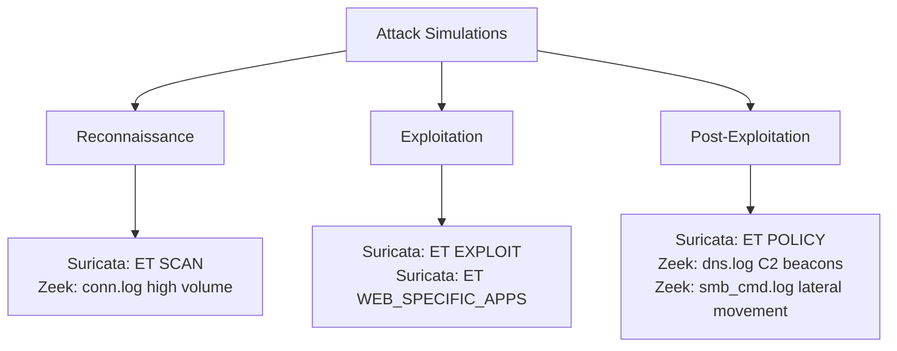

# Security Onion Configuration

Sensor tuning and configuration notes for the homelab Security Onion deployment.

---

## Deployment Type

**Standalone** — single node running all Security Onion components:
- Zeek (network metadata)
- Suricata (IDS/IPS)
- Elasticsearch (local storage)
- Kibana (analysis interface)
- so-analyst (analyst interface)

---

## Interface Configuration

```yaml
# /etc/securityonion/so.conf (relevant sections)

# Management interface — receives admin traffic
MGTNIC=eth0
MGTIP=10.0.10.30
MGTCIDR=24
MGTGATEWAY=10.0.10.1

# Monitor interface — passive capture from SPAN port
MONNIC=eth1
# No IP — purely passive
```

---

## Suricata Rule Tuning

Default Suricata rules generate significant noise in a lab environment. The following suppressions reduce false positives from expected lab traffic:

```yaml
# /etc/suricata/threshold.conf

# Suppress Nmap scan alerts from Kali (expected attack traffic)
suppress gen_id 1, sig_id 2010936, track by_src, ip 10.0.20.10

# Suppress noisy ET SCAN rules for lab scanning activity
suppress gen_id 1, sig_id 2000545, track by_src, ip 10.0.20.0/24

# Threshold repeated brute force alerts (max 1 alert per 60s per source)
threshold gen_id 1, sig_id 2019876, type threshold, track by_src, count 1, seconds 60
threshold gen_id 1, sig_id 2002910, type threshold, track by_src, count 1, seconds 60
```

---

## Custom Suricata Rules

Local rules added for lab-specific detections:

```
# /etc/suricata/rules/local.rules

# Detect BloodHound LDAP enumeration
alert tcp 10.0.20.0/24 any -> 10.0.30.10 389 (msg:"ET LAB BloodHound LDAP Enumeration"; content:"(objectclass=*)(objectcategory="; nocase; sid:9000001; rev:1;)

# Detect Kerberoasting (high volume SPN requests)
alert dns any any -> 10.0.30.10 53 (msg:"ET LAB Possible Kerberoasting - High Volume SPN"; threshold: type threshold, track by_src, count 10, seconds 30; sid:9000002; rev:1;)

# Detect NTLM relay attempts
alert tcp 10.0.20.0/24 any -> 10.0.30.0/24 445 (msg:"ET LAB Possible NTLM Relay Attempt"; content:"NTLMSSP"; content:"NTLMSSP_AUTH"; distance:0; sid:9000003; rev:1;)

# Detect reverse shell (common ports)
alert tcp 10.0.30.0/24 any -> 10.0.20.0/24 [4444,1234,9001,9090] (msg:"ET LAB Reverse Shell - Common C2 Port"; sid:9000004; rev:1;)
```

---

## Zeek Configuration

Custom Zeek scripts for enhanced logging:

```zeek
# /etc/zeek/site/local.zeek

# Load all default scripts
@load base/frameworks/notice/main
@load policy/tuning/json-logs.zeek

# Enable detailed logging
@load policy/protocols/conn/vlan-logging
@load policy/protocols/dns/detect-external-names
@load policy/protocols/http/detect-sqli
@load policy/protocols/smb/log-cmds

# Log all DNS queries (useful for detecting C2 beacons)
redef DNS::log_all_queries = T;

# Increase connection table size for busy lab
redef table_expire_delay = 15secs;
```

---

## Alert Categories to Monitor

When running attack simulations, these Security Onion alert categories are most relevant:



---

*[← Back to README](https://github.com/chad-hackerman/homelab/edit/main/)*
