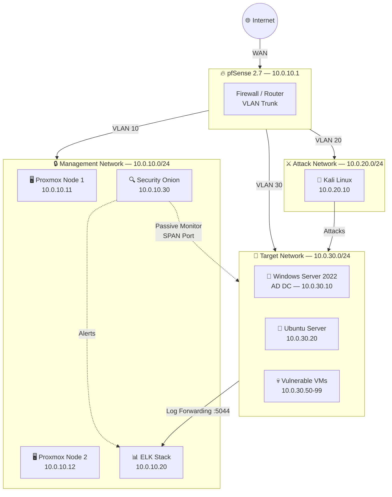
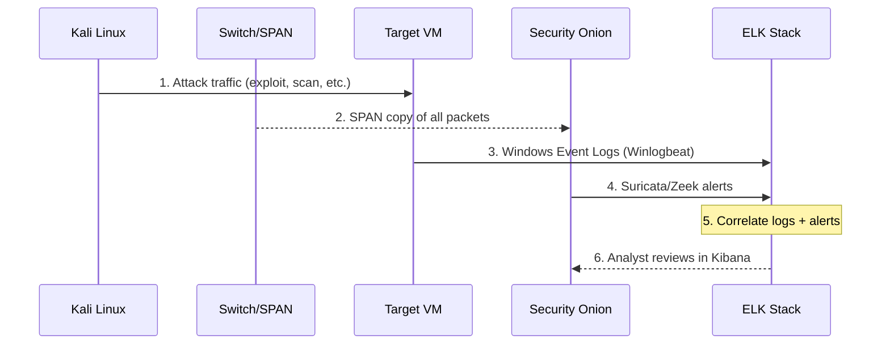
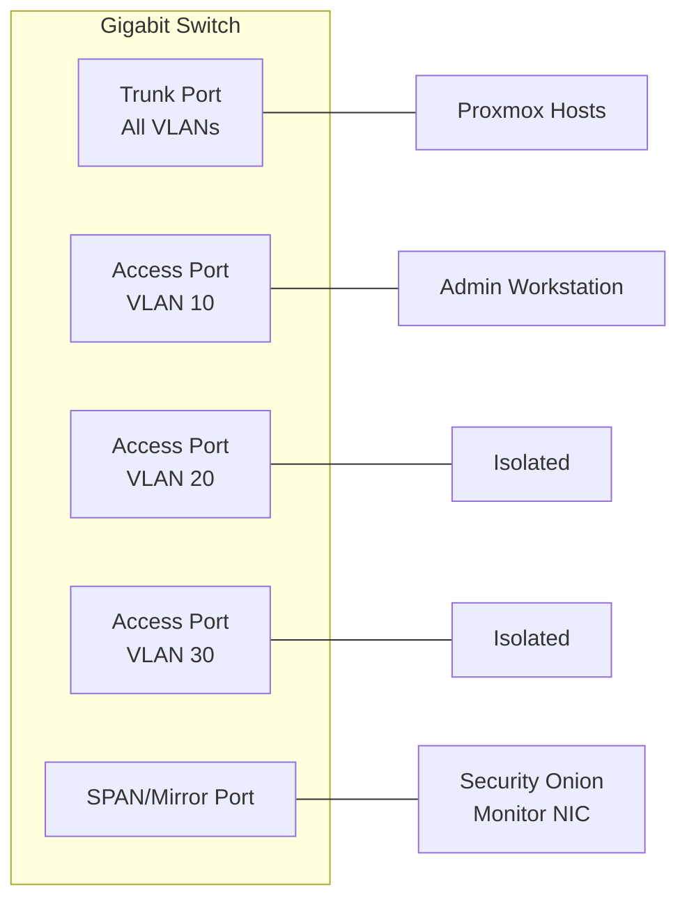
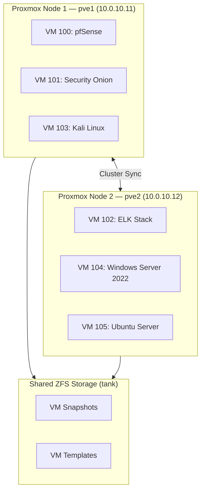

# Network Topology Diagrams

---

## Full Lab Topology

---

## Traffic Flow — Attack Simulation

---

## VLAN Segmentation

---

## VM Placement Across Proxmox Cluster

---

*[← Back to README](../README.md)*
