# Learning Outcomes

Skills and experience gained through building and operating this homelab.

---

## Skills Developed

### Network Security
- Designed and implemented a segmented network with three isolated security zones
- Configured VLAN trunking and inter-VLAN routing on enterprise hardware
- Built and tuned pfSense firewall rules for zone-based access control
- Set up passive traffic monitoring via switch mirror/SPAN ports

### SIEM & Log Analysis
- Deployed a full ELK Stack (Elasticsearch, Logstash, Kibana) from scratch
- Built Logstash pipelines to ingest Windows Event Logs, Syslog, and Suricata alerts
- Created Kibana dashboards for real-time threat monitoring
- Correlated events across multiple log sources to identify attack patterns

### Intrusion Detection
- Installed and configured Security Onion in standalone mode
- Tuned Suricata IDS rules to reduce false positives
- Analyzed Zeek network logs to identify suspicious traffic patterns
- Correlated IDS alerts with SIEM data for full attack timelines

### Active Directory Security
- Built an Active Directory domain from scratch (homelab.local)
- Applied security hardening via Group Policy Objects (GPOs)
- Simulated common AD attacks: Kerberoasting, Pass-the-Hash, BloodHound enumeration
- Practiced detection and response for AD-based attacks

### Penetration Testing Practice
- Conducted full attack simulations from Kali Linux against target VMs
- Practiced methodology: recon → scanning → exploitation → post-exploitation
- Used tools: Nmap, Metasploit, Burp Suite, BloodHound, CrackMapExec, Impacket

### Virtualization & Infrastructure
- Built and managed a 2-node Proxmox cluster
- Configured ZFS storage pools with RAID 10
- Managed VM lifecycle: provisioning, snapshots, cloning, migration
- Scripted VM provisioning with Proxmox CLI (`qm` commands)

---

## Certifications Prepared

| Certification | Relevant Lab Work |
|--------------|-------------------|
| CompTIA Security+ | Network segmentation, SIEM, IDS/IPS concepts |
| CompTIA CySA+ | Log analysis, threat hunting, incident response |
| OSCP | Exploitation practice, AD attacks, post-exploitation |
| CEH | Full attack lifecycle simulation |

---

## Attack Scenarios Practiced

```mermaid
flowchart LR
    KALI[Kali Linux\n10.0.20.10]

    subgraph attacks ["Attack Scenarios"]
        A1[🔍 Network Recon\nnmap, masscan]
        A2[🌐 Web App Attacks\nBurp Suite, SQLMap]
        A3[🏢 AD Enumeration\nBloodHound, ldapdomaindump]
        A4[🔑 Credential Attacks\nKerberoasting, Pass-the-Hash]
        A5[💻 Exploitation\nMetasploit, manual exploits]
        A6[🔄 Lateral Movement\nCrackMapExec, Impacket]
    end

    subgraph detection ["Detection & Response"]
        D1[Security Onion\nAlert fires]
        D2[ELK Stack\nLog correlation]
        D3[Analyze TTPs\nMITRE ATT&CK mapping]
        D4[Build Detection Rules\nSuricata / Sigma]
    end

    KALI --> attacks
    attacks --> detection
    detection -->|Improve Defenses| KALI
```

---

## Tools Used

| Category | Tools |
|----------|-------|
| Hypervisor | Proxmox VE 8.1 |
| Firewall | pfSense 2.7 |
| NSM / IDS | Security Onion 2.4, Suricata, Zeek |
| SIEM | ELK Stack 8.x (Elasticsearch, Logstash, Kibana) |
| Penetration Testing | Kali Linux, Metasploit, Nmap, Burp Suite |
| AD Attacks | BloodHound, CrackMapExec, Impacket, Rubeus |
| Log Forwarding | Winlogbeat, Filebeat |

---

*[← Back to README](../README.md)*
