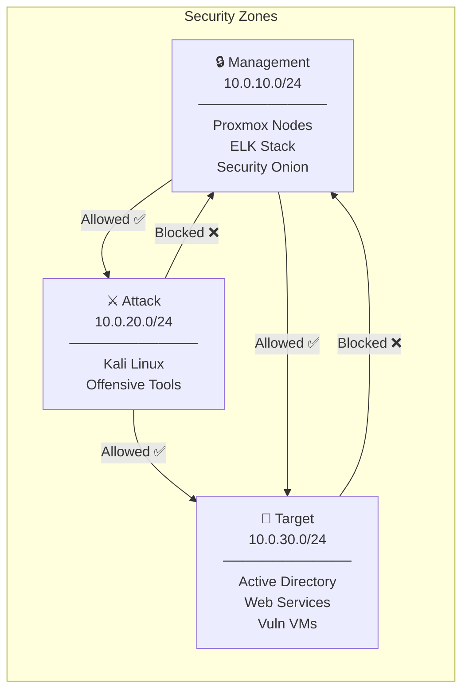
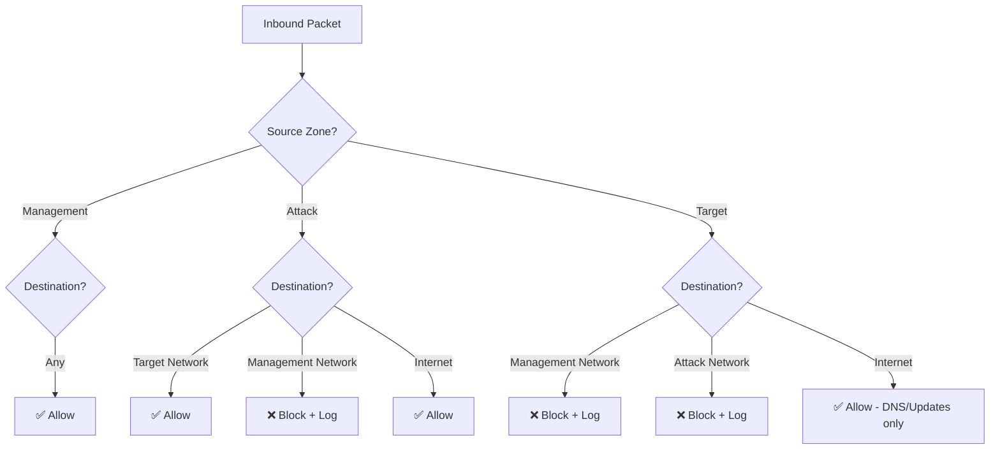
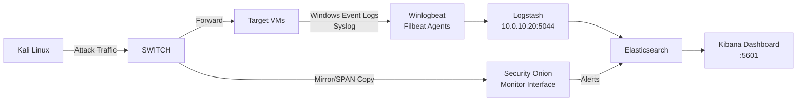

# Network Design

Design decisions and rationale behind the homelab network architecture.

---

## Design Goals

- **Isolation** — Attack tools cannot reach management infrastructure
- **Visibility** — All target network traffic is captured and analyzed
- **Realism** — Mirrors enterprise network segmentation patterns
- **Flexibility** — Easy to add new VMs to any zone

---

## Zone Architecture

---

## Firewall Rules

---

## Traffic Monitoring Design

The mirror port on the switch copies all Target Network traffic to Security Onion's passive monitor interface. This gives full packet capture without being in-line — Security Onion can analyze traffic without affecting performance or being detected by attack tools.

---

## IP Addressing

| Zone | Subnet | Gateway | DHCP Range |
|------|--------|---------|------------|
| Management | 10.0.10.0/24 | 10.0.10.1 | 10.0.10.100-200 |
| Attack | 10.0.20.0/24 | 10.0.20.1 | 10.0.20.100-200 |
| Target | 10.0.30.0/24 | 10.0.30.1 | 10.0.30.100-200 |

**Static IPs (reserved):**

| Host | IP |
|------|----|
| pfSense (mgmt) | 10.0.10.1 |
| Proxmox Node 1 | 10.0.10.11 |
| Proxmox Node 2 | 10.0.10.12 |
| ELK Stack | 10.0.10.20 |
| Security Onion | 10.0.10.30 |
| Kali Linux | 10.0.20.10 |
| Windows Server 2022 (DC) | 10.0.30.10 |
| Ubuntu Server | 10.0.30.20 |

---

## Design Decisions

**Why three zones instead of two?**
Separating the attack network from the management network is critical. If Kali were on the management network, a mistake or pivot during a test could expose the SIEM, Proxmox, or pfSense admin interfaces.

**Why passive monitoring instead of inline IDS?**
Inline IDS introduces latency and becomes a single point of failure. Passive monitoring via a mirror port gives full visibility with zero network impact, which is more representative of how enterprise SOCs operate.

**Why pfSense over a hardware firewall?**
pfSense gives full visibility into rule configuration as code, is free, and runs well as a VM. It also makes the firewall config documentable and reproducible.

---

*[← Back to README](../README.md)*
