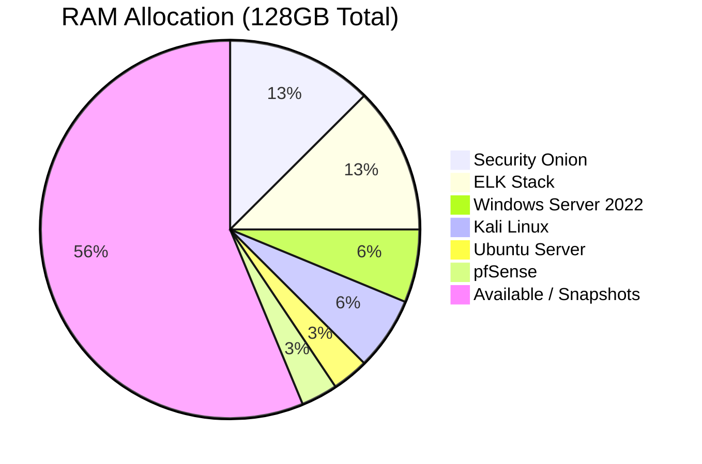

# VM Provisioning

Resource allocation and configuration details for each virtual machine in the lab.

---

## Resource Summary



---

## VM Specifications

### pfSense (VM ID: 100)

| Setting | Value |
|---------|-------|
| CPU | 2 cores |
| RAM | 4GB |
| Disk | 32GB |
| NIC 1 | WAN (bridged to physical NIC) |
| NIC 2 | LAN trunk (all VLANs) |
| Node | pve1 |

**Proxmox creation command:**
```bash
qm create 100 --name pfsense --memory 4096 --cores 2 \
  --net0 virtio,bridge=vmbr0 \
  --net1 virtio,bridge=vmbr1 \
  --scsi0 tank:32 \
  --cdrom local:iso/pfSense-CE-2.7.2-RELEASE-amd64.iso \
  --boot order=ide2
```

---

### Security Onion (VM ID: 101)

| Setting | Value |
|---------|-------|
| CPU | 4 cores |
| RAM | 16GB |
| Disk | 500GB |
| NIC 1 | Management (VLAN10) |
| NIC 2 | Monitor — promiscuous mode (VLAN30 mirror) |
| Node | pve1 |

**Enable promiscuous mode on monitor NIC:**
```bash
# On Proxmox host — required for passive traffic capture
ip link set vnet1 promisc on

# Make persistent via /etc/network/interfaces
post-up ip link set vnet1 promisc on
```

---

### ELK Stack (VM ID: 102)

| Setting | Value |
|---------|-------|
| CPU | 4 cores |
| RAM | 16GB |
| Disk | 200GB |
| NIC | VLAN10 — 10.0.10.20 |
| Node | pve2 |

**JVM heap sizing** (set to 50% of VM RAM):
```bash
# /etc/elasticsearch/jvm.options
-Xms8g
-Xmx8g
```

---

### Kali Linux (VM ID: 103)

| Setting | Value |
|---------|-------|
| CPU | 4 cores |
| RAM | 8GB |
| Disk | 100GB |
| NIC | VLAN20 — 10.0.20.10 |
| Node | pve1 |

**Enable GPU passthrough** (optional, for hashcat):
```bash
# Add to /etc/pve/qemu-server/103.conf
hostpci0: 0000:01:00,pcie=1
```

---

### Windows Server 2022 (VM ID: 104)

| Setting | Value |
|---------|-------|
| CPU | 4 cores |
| RAM | 8GB |
| Disk | 100GB |
| NIC | VLAN30 — 10.0.30.10 |
| Node | pve2 |
| Role | Active Directory Domain Controller |

**Install Winlogbeat for log forwarding to ELK:**
```powershell
# Download and install Winlogbeat
Invoke-WebRequest -Uri "https://artifacts.elastic.co/downloads/beats/winlogbeat/winlogbeat-8.12.0-windows-x86_64.zip" -OutFile winlogbeat.zip
Expand-Archive winlogbeat.zip -DestinationPath "C:\Program Files\Winlogbeat"

cd "C:\Program Files\Winlogbeat"
.\install-service-winlogbeat.ps1
```

---

### Ubuntu Server (VM ID: 105)

| Setting | Value |
|---------|-------|
| CPU | 2 cores |
| RAM | 4GB |
| Disk | 50GB |
| NIC | VLAN30 — 10.0.30.20 |
| Node | pve2 |
| Services | Apache, MySQL, DVWA, Metasploitable services |

**Install DVWA (Damn Vulnerable Web Application):**
```bash
sudo apt install -y apache2 mysql-server php php-mysqli php-gd libapache2-mod-php
git clone https://github.com/digininja/DVWA.git /var/www/html/dvwa
sudo chown -R www-data:www-data /var/www/html/dvwa
sudo systemctl restart apache2
```

---

## Snapshot Strategy

Proxmox snapshots are used to quickly restore VMs to a known-good state after testing:

```bash
# Create snapshot before a test
qm snapshot <vmid> <snapname> --description "Clean state before pentest"

# Example
qm snapshot 104 "pre-attack-clean" --description "AD clean state - no attacks"

# Restore after testing
qm rollback 104 pre-attack-clean
```

**Snapshot naming convention:** `<date>-<description>`
Example: `2024-01-15-clean-ad-setup`

---

*[← Back to README](../README.md)*
